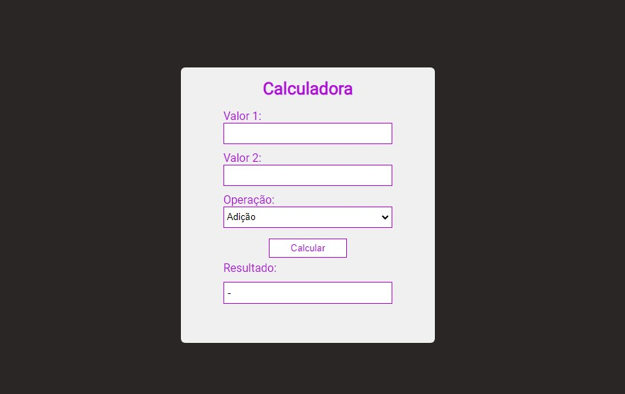
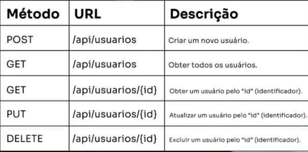
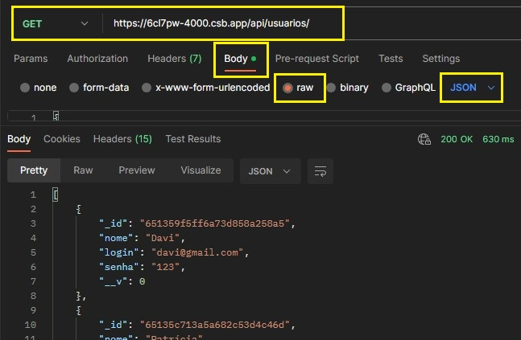
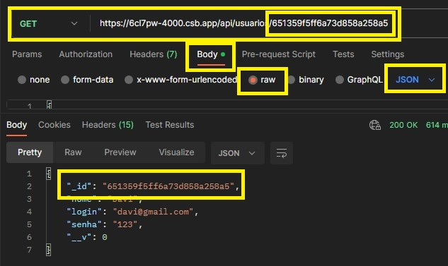
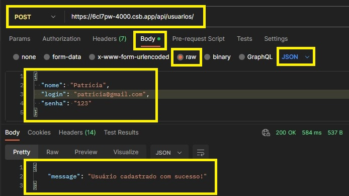
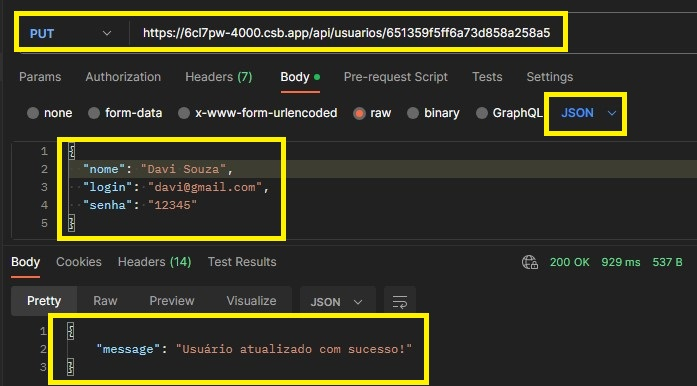
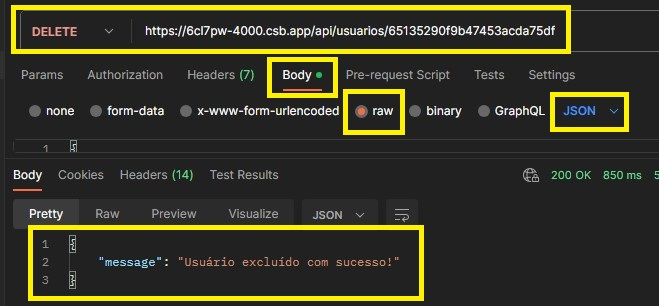
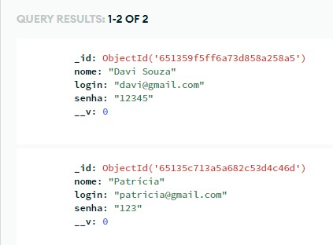

<h1 align="center"> Programação Básica em Back-End - 20h - SENAI/SC </h1>

  <a href="#-tecnologias">Tecnologias</a>&nbsp;&nbsp;&nbsp;|&nbsp;&nbsp;&nbsp;
  <a href="#-projeto">Projeto API</a>&nbsp;&nbsp;&nbsp;|&nbsp;&nbsp;&nbsp;
  <a href="#-layout">Layout Calculadora</a>&nbsp;&nbsp;&nbsp;|&nbsp;&nbsp;&nbsp;

  

---

## 🚀 Tecnologias

### Conteúdo do curso

### Módulo I - Fundamentos da linguagem JavaScript

    - Configuração do ambiente de desenvolvimento utilizando a plataforma Codesandbox;
    - Introdução à linguagem JavaScript;
    - Tipos de dados;
    - Operadores aritméticos, relacionais e lógicos;
    - Expressões lógicas e aritméticas;
    - Estruturas de controle e repetição;
    - Funções;

### Módulo II - Fundamentos básicos de back-end

    - Introdução à plataforma Node.js;
    - Introdução ao framework Express;
    - Instalação e configuração do SGBD MongoDB na nuvem;
    - Estilo arquitetural REST;
    - Teste de API utilizando a ferramenta Postman.

## 💻 Módulo I - Calculadora com JS

- [Visite o projeto online](https://patyfil.github.io/back-end-senai-sc/)

## 🔖 Layout

  
 Calculadora com JS 

   
  

## Módulo II - API REST

Desenvolvimento de uma API REST usando o Node.js, Express.js e MongoDB Atlas para armazenar esses dados.  

A aplicação é responsável por realizar as operações de CRUD básicas com a entidade “Usuário” com os seguintes Campos:  
nome, login e senha.  
• Cada usuário é uma instância dessa entidade, e eles compartilham as mesmas características básicas, como nome, login e senha.  

- Em resumo:  
  É necessário criar EndPoints para:  
      - Criar usuários  
      - Ler Usuários  
      - Atualizar Usuários  
      - Excluir Usuários  

A estrutura da API REST está representada na tabela abaixo:  

   

### Necessários instalar os seguintes módulos

- Express (usado para o middleware criar vários terminais CRUD)  
- Mongoose (usado para gerenciar dados no MongoDB, usando várias consultas)  
- Body-parser (usado para processar dados enviados por meio de um corpo de solicitação HTTP)  
- Cors (usado para permitir ou restringir recursos solicitados em um servidor web, dependendo de onde a solicitação HTTP foi iniciada)  

• DICA: Se basear em um EndPoint com método POST para finalizar a sua demanda de criação da rota de edição dos usuários, pois elas são muito similares.  

## 🔖 Projeto
### TESTES

Fazer o teste de todas as rotas utilizando a ferramenta ***Postman***.  

- Rota para exibir uma mensagem ao usuário  
Acesso: GET https://6cl7pw-4000.csb.app  
Saída: Olá mundo! Esta é a página inicial da nossa aplicação.  

- Rota padrão para verificação do funcionamento da aplicação  
Acesso GET: https://6cl7pw-4000.csb.app/api  
Saída: {"message":"Olá mundo! Está é a nossa API desenvolvida em Node.js."}  

## CRUD

- Método GET: retornar a listagem de todos os usuários  
Acesso: GET https://6cl7pw-4000.csb.app/api/usuarios/  

  

---

- Método GET: listar as informações de um usuário específico  
Acesso Exemplo: GET https://6cl7pw-4000.csb.app/api/usuarios/usuario_id  
Acesso: GET https://6cl7pw-4000.csb.app/api/usuarios/651359f5ff6a73d858a258a5  

  

---

- Método POST: cadastrar um usuário  
Acesso: POST https://6cl7pw-4000.csb.app/api/usuarios  

  

---

- Método PUT: atualizar as informações de um usuário específico  
Acesso: PUT https://6cl7pw-4000.csb.app/api/usuarios/usuario_id  

  

---

- Método DELETE: deletar um usuário específico  
Acesso: DELETE https://6cl7pw-4000.csb.app/api/usuarios/usuario_id  

  

---

- MongoDB Atlas  
  

---

Feito com ♥ by Patrícia
